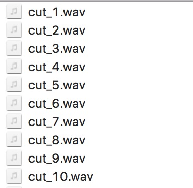
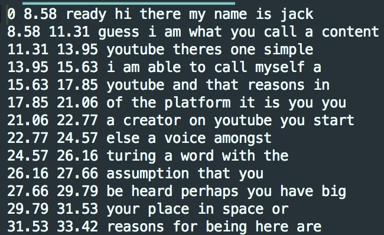
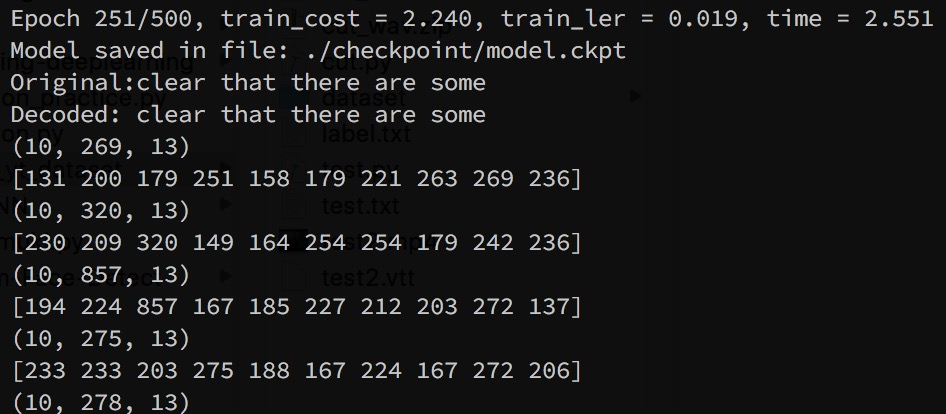

# mfcc_ctc_speech
Using CTC loss function combine mfcc feature test on youtube dataset
#### Dependency:
- for create label (gen_label.py)  
python3 - 3.6.1  
webvtt-py - 0.4.0 
- for cuting dataset (mp4_to_cut_wav.py)  
python2 - 2.7.14  
moviepy - 0.2.3.2  
cv2 - 3.3.0 
- for training (ctc_speech_recognition.py)  
python2 - 2.7.14  
tensorflow - 1.4.0
#### Usage:
Step 1 : Download youtube vedio with cc subtitle  
Step 2 : python gen_label.py - to generate clear label  
Step 3 : python mp4_to_cut_wav.py - to generate wav dataset  
Step 4 : python ctc_speech_recognition.py - training  

#### Dataset description:
  

#### Training Process:

